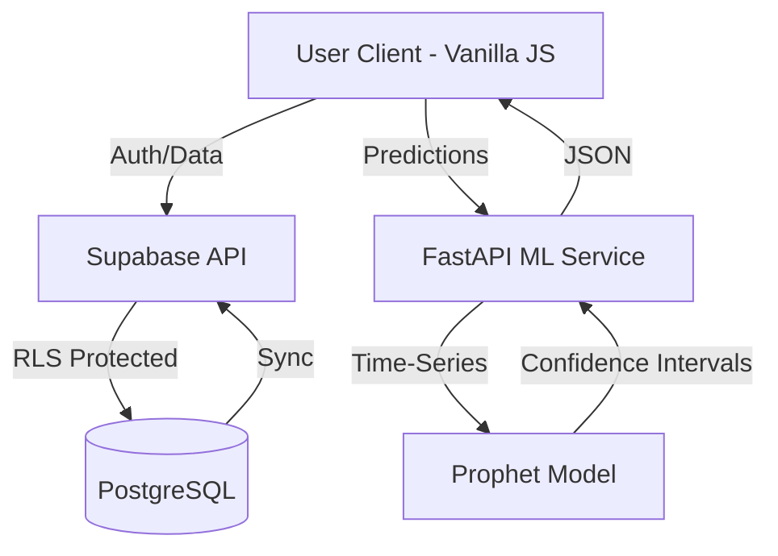
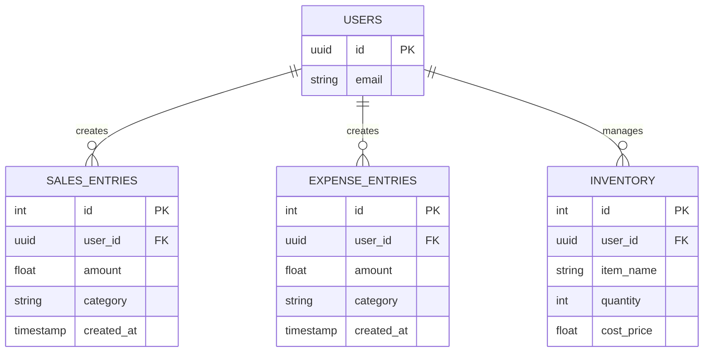

# 📊 Product Requirements Document: HisaabPro

> [!NOTE]
> **HisaabPro** - *Smart Cash Flow & Business Intelligence for Kiryana Stores*
> 
> **Micathon '26** · Microsoft Club GIKI · Theme: **Money Moves**
> **Version:** 1.0 (April 2026)

---

## 🛠️ Tech Stack & Overview

| Component | Technology |
| :--- | :--- |
| **Frontend** | HTML5, CSS3 (Vanilla), JavaScript (ES6+) |
| **Backend / DB** | Supabase (Auth, PostgreSQL, RLS) |
| **ML Service** | Python (FastAPI, scikit-learn, Prophet) |
| **Hosting** | Netlify (Frontend), Render (ML API) |
| **Analytics** | Chart.js for real-time visualization |

---

## 1. 🚀 Product Overview

HisaabPro is a lightweight, mobile-first web application designed specifically for **kiryana (retail) store owners** in Pakistan. It transforms chaotic daily transactions into actionable business intelligence, tracking cash flow and inventory while providing ML-powered revenue forecasting—all without the complexity of a traditional ERP.

### 1.1 Problem Statement

Small retailers (kiryana stores) in Lahore, Karachi, or Rawalpindi typically:
- Handle **50–150 cash transactions daily** manually.
- Have **zero visibility** into real-time profitability.
- Risk **stockouts or cash crunches** due to lack of forecasting.
- Are intimidated by complex accounting software like Excel.

> [!IMPORTANT]
> **The Use Case:** At the end of a long day, a store owner spends 5 minutes logging sales/expenses and instantly sees their net position and a 30-day forecast.

### 1.2 Vision

> [!TIP]
> **"Empowering 3.6 million small retailers in Pakistan with professional-grade financial visibility as easily as sending a WhatsApp message."**

---

## 👤 2. User Persona & Stories

### 2.1 Primary Persona: "Imran Bhai"
*The Heart of the Neighborhood Store*

| Attribute | Details |
| :--- | :--- |
| **Demographics** | 38 years old, Johar Town, Lahore |
| **Business** | Running a Kiryana store since 2014; PKR 80,000 avg. monthly revenue |
| **Tech Usage** | Mid-range Android smartphone; limited laptop access |
| **Current Workflow** | Paper notebooks for credit (*udhaar*); mental math for daily totals |
| **Pain Points** | Margin blind spots; month-end cash surprises; restocking anxiety |
| **Core Goal** | Effortless financial clarity to protect his family's livelihood |

### 2.2 User Stories
*   *"As a store owner, I want to **log daily sales in seconds** so I can get back to my customers."*
*   *"As a store owner, I want to **see if I'm making a profit** without spending hours on a calculator."*
*   *"As a store owner, I want to **know what to buy** for next week so I don't waste cash on slow-moving stock."*
*   *"As a store owner, I want a **revenue forecast** so I can plan for my children's school fees or rent."*

---

## 🎯 3. Scope & Objectives

### 3.1 MVP Goals (Hackathon Scope)
- [x] **Fast Entry Form**: Mobile-optimized log for sales and expenses.
- [x] **Real-time Dashboard**: Dynamic visualization of income vs. expenses.
- [x] **Inventory Intel**: Automatic stock level tracking with low-stock alerts.
- [x] **ML Forecasting**: Predictive revenue analysis for the next 30 days.
- [x] **Smart Categorization**: Automated tagging (Stock, Rent, Utilities, Misc).
- [x] **Insight Cards**: Human-readable summaries of business health.

### 3.2 Out of Scope (Non-Goals)
- Native Mobile Apps (iOS/Android).
- Multi-branch or multi-user access.
- Bank API integrations or GST/Tax filing.
- Udhaar (Credit) management system.
- Invoice generation and printing.

---

## 🏗️ 4. Technical Architecture

### 4.1 System Flow

### 4.2 Database Schema

### 4.3 Why Facebook Prophet?
> [!NOTE]
> We chose **Prophet** for forecasting because it is optimized for business time-series:
> - **Seasonality:** Handles weekly and monthly cycles common in retail.
> - **Confidence:** Provides upper/lower bound intervals for "safe" planning.
> - **Efficiency:** Lightweight enough to run on a free-tier Render instance.
> - **Sparse Data:** Robust even with only 30–60 daily entries.

---

## 🚧 5. Constraints & Risks

- **Temporal:** 48-hour development window.
- **Data:** Cold-start problem for new users (forecasting requires initial history).
- **Latency:** Render free tier "cold starts" for ML API.
- **UX:** Designing for low-digital-literacy users requires extreme simplicity.

---

## 📅 6. Build Plan & Roadmap

1. **Phase 1 (Day 1 Morning):** Supabase setup, Auth, Schema, and RLS.
2. **Phase 2 (Day 1 Afternoon):** Core entry forms and basic inventory tracking.
3. **Phase 3 (Day 1 Evening):** Dashboard UI & Chart.js integration.
4. **Phase 4 (Day 2 Morning):** Python ML Service deployment & Prophet tuning.
5. **Phase 5 (Day 2 Afternoon):** Insight cards, UI polish, and bug fixing.

---

## 🏆 7. Judging Alignment (Micathon '26)

| Criteria | Strategy |
| :--- | :--- |
| **Theme (25%)** | Direct "Money Moves" tool for an underserved segment. |
| **Impact (25%)** | Solves a daily profit-loss puzzle for 3.6M retailers. |
| **Creativity (15%)** | Brings high-end ML forecasting to a "mom-and-pop" context. |
| **Technical (15%)** | Real-world stack (Supabase/FastAPI) vs. static mockups. |
| **Usability (20%)** | Minimalist one-page dashboard with zero learning curve. |

---

## 🔮 8. ML Defensibility & AI Strategy

> [!CAUTION]
> **What HisaabPro is NOT:** It is not a financial advisor. It does not guarantee profits or handle legal accounting.

**The Edge:** Most apps show you the past. HisaabPro uses the **Prophet model** to illuminate the future, giving "Imran Bhai" a proactive warning if his cash flow looks tight for the coming month.

---

## 🔒 9. Trust, Security & Privacy

- **Isolation:** Row Level Security (RLS) ensures data is visible *only* to the owner.
- **Security:** Managed Auth via Supabase (Industry standard).
- **Privacy:** No collection of sensitive personal IDs (CNIC, Bank ACs).
- **Integrity:** HTTPS enforced; no hardcoded secrets.

---

## 🎤 10. Pitch & Success

### 3-Minute Pitch Hook
*"High-end retailers have SAP and analysts. Imran Bhai has a 10-rupee notebook. Let's give him a crystal ball."*

### Key Success Metrics
- **Demo Win:** Account creation to first Sale Log in **< 60 seconds**.
- **User KPI:** Daily active use (> 5 entries/day).
- **ML Goal:** < 20% Mean Absolute Percentage Error (MAPE) on forecasts.

---
